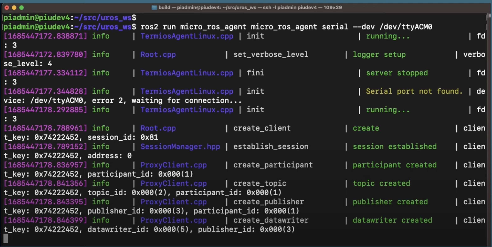

This repo contains the hardware interface needed for ros_control communication between the Pi and Pico.
### Running the MicroROS Agent
On the Pi, run the following commands to start the MicroROS Agent:
```bash 
    cd robot_ws/micorros_ws
    
    source /opt/ros/humble/setup.bash && source install/local_setup.bash
    
    ros2 run micro_ros_agent micro_ros_agent serial --dev /dev/ttyACM0
```
The MicroROS Agent should now be running and ready to communicate with the Pico all topics on the pico should now be present.  You should see an output similar to this:

If not try unplugging and replugging the Pico.
